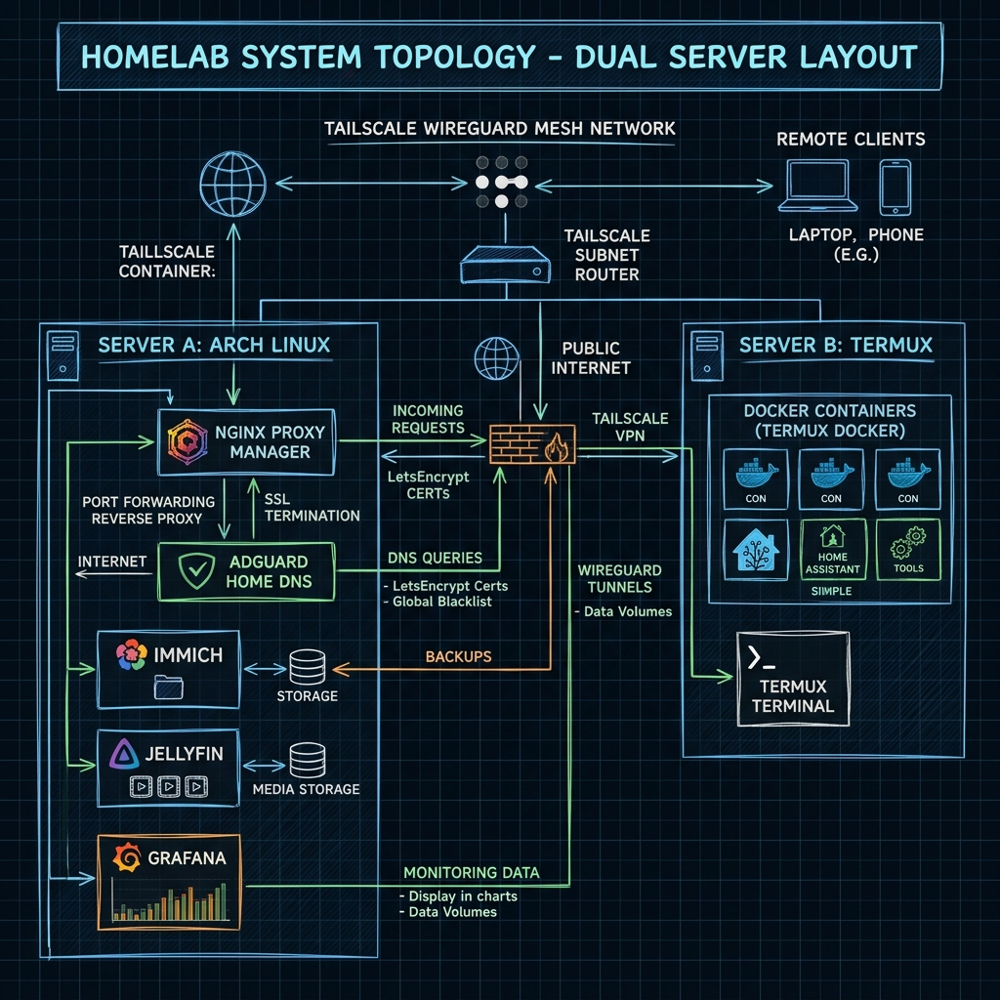
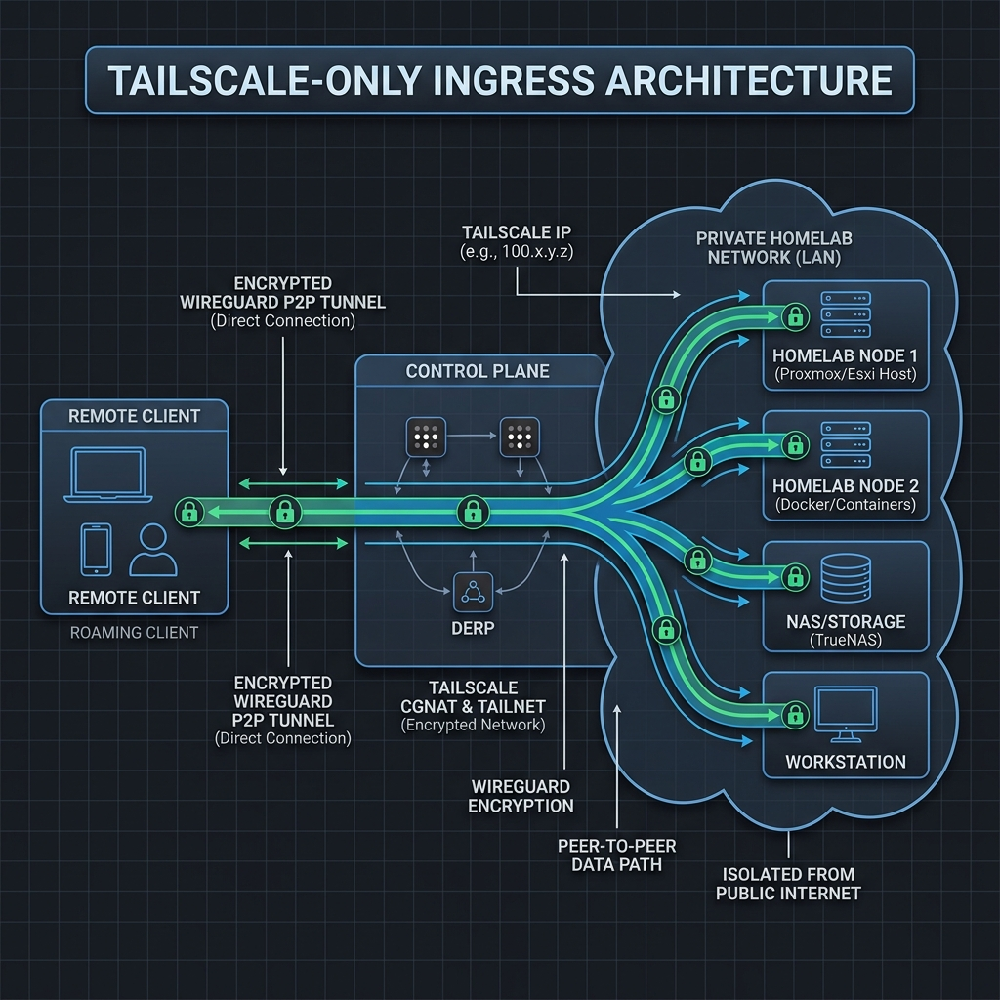
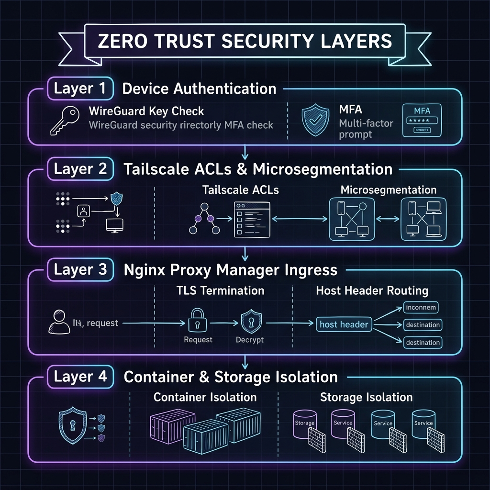
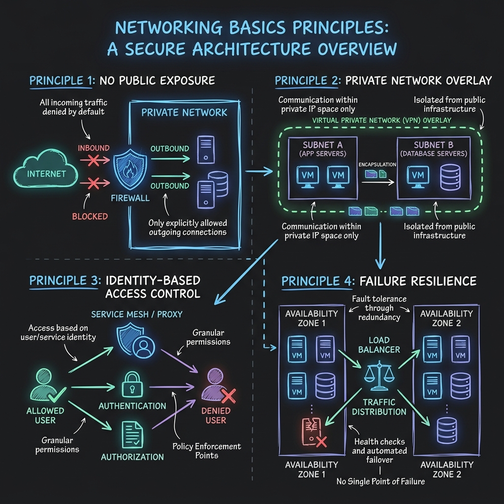

# Homelab Documentation

A production-inspired self-hosted homelab focused on Linux, networking, automation, monitoring, media services, and infrastructure management.

This repository documents the architecture, deployment, networking, and operational practices behind my personal homelab. The goal is to build practical experience with production-like infrastructure while exploring modern self-hosting technologies.

---

## Website

**Documentation**

https://terrich-hash.github.io/homelab/

---

## Architecture Overview

The homelab consists of two primary servers connected through a Zero Trust mesh network using Tailscale. External traffic is securely routed through Nginx Proxy Manager with automated SSL termination, while services are isolated inside Docker containers.

<p align="center">

</p>

---

# Architecture Diagrams

## Overall Homelab Architecture

<p align="center">

</p>

---

## Network Topology

Visual representation of the complete network topology including routing, VLANs, reverse proxy, and connected services.

<p align="center">

</p>

---

## Reverse Proxy Flow

Traffic routing through Nginx Proxy Manager with automatic SSL termination using Let's Encrypt.

<p align="center">

</p>

---

## Tailscale Mesh VPN

Zero Trust networking architecture connecting every device securely without exposing internal services.

<p align="center">

</p>

---

## Zero Trust Network

Complete Zero Trust architecture illustrating encrypted communication between servers.

<p align="center">

</p>

---

## Networking Fundamentals

Overview of the networking concepts implemented throughout the homelab.

<p align="center">

</p>

---

# Infrastructure

## Server A

**Lenovo Laptop**

Operating System

- Arch Linux

Responsibilities

- Docker Host
- Immich
- Jellyfin
- Redis
- Prometheus
- Grafana
- Reverse Proxy
- Monitoring

---

## Server B

**Android Device**

Operating System

- Android 13
- Termux
- Docker

Responsibilities

- AdGuard Home
- DNS Filtering
- Backup Services
- Lightweight Containers

---

# Core Technologies

### Operating Systems

- Arch Linux
- Android (Termux)

### Containers

- Docker
- Docker Compose

### Networking

- Tailscale
- Nginx Proxy Manager
- Let's Encrypt
- DNS
- HTTPS

### Monitoring

- Grafana
- Prometheus

### Storage

- Immich
- Redis

### Media

- Jellyfin

### Security

- SSL
- Reverse Proxy
- Zero Trust Networking
- Private VPN
- DNS Filtering

---

# Features

- Self-hosted infrastructure
- Zero Trust networking
- Automatic SSL certificates
- Secure remote access
- Dockerized services
- Monitoring dashboards
- Metrics collection
- Media streaming
- Photo management
- DNS filtering
- Documentation-first approach

---

# Documentation

The documentation covers:

- Linux
- Docker
- Networking
- Reverse Proxy
- DNS
- Monitoring
- Security
- Services
- Infrastructure
- Maintenance
- Troubleshooting

---

# Project Structure

```text
docs/
├── assets/
│   ├── architecture_diagram.png
│   ├── network_topology_diagram.png
│   ├── reverse_proxy_diagram.png
│   ├── tailscale_architecture_diagram.png
│   ├── zero_trust_architecture_diagram.png
│   └── networking_basics_diagram.png
│
├── linux/
├── networking/
├── servers/
├── services/
├── maintenance/
├── index.md
└── architecture.md
```

---

# Goals

- Learn production infrastructure
- Master Linux administration
- Improve networking knowledge
- Explore self-hosting
- Practice infrastructure documentation
- Build reliable systems
- Automate repetitive tasks
- Experiment with new technologies

---

# Future Roadmap

- Kubernetes Cluster
- High Availability
- GitOps
- Infrastructure as Code
- CI/CD Pipelines
- NAS Integration
- Automated Backups
- Object Storage
- Service Discovery
- Secrets Management
- Multi-node Monitoring
- Container Orchestration

---

# License

---

**Made with Linux, Docker, and lots of coffee ☕**
