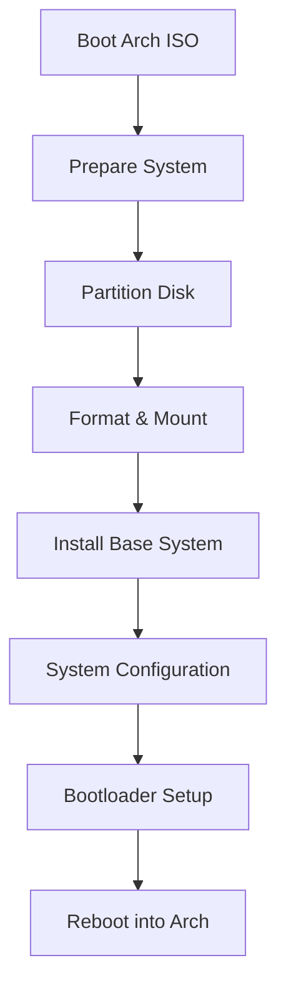
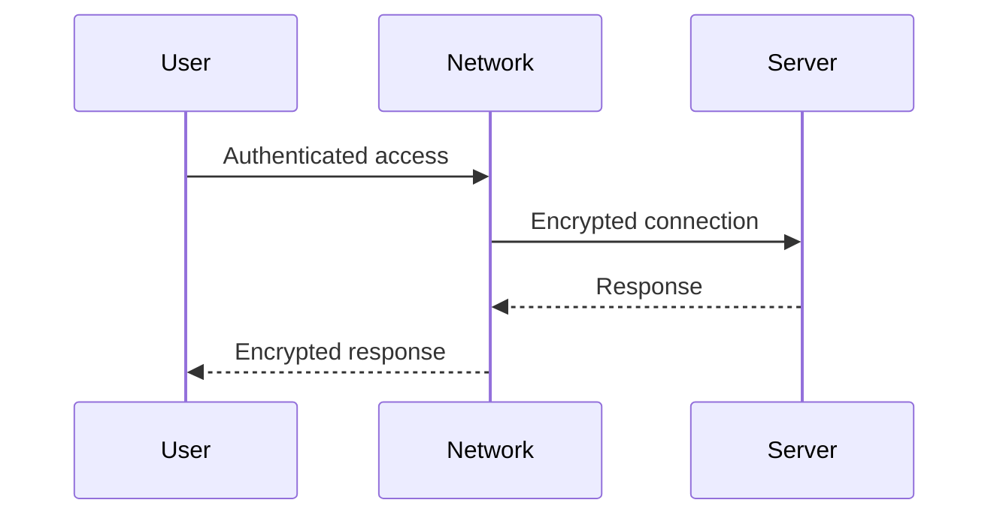
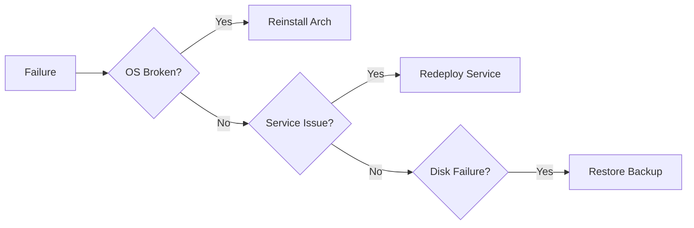

# 🐧 Arch Linux Manual Installation
This document describes a pure CLI-based Arch Linux installation for servers and homelabs.

- No GUI
- No installer scripts
- No shortcuts
- Everything is explicit and reproducible

## Why Manual Install?
- Learn Linux internals
- Minimal system
- Full control

## Steps
1. Boot ISO
2. Partition disk
3. Mount filesystems
4. Install base
5. Install bootloader
6. Create users


## Step 1 — Boot & Preparation
Boot using the official Arch Linux ISO.

Verify UEFI mode:

```
ls /sys/firmware/efi/efivars
```

Enable NTP and set keyboard:

```
loadkeys us
timedatectl set-ntp true
```
## Step 2 — Disk Partitioning (CLI)

List available disks:

```
lsblk
```
Example Partition Scheme
```
Disk: /dev/sda
├─ EFI   512 MB   FAT32   /boot
└─ Root  Remaining  ext4  /
```     

Partition using **cfdisk**:
```
cfdisk /dev/sda
```
Create:

- EFI System Partition
- Linux filesystem partition

## Step 3 — Format & Mount
```
mkfs.fat -F32 /dev/sda1
mkfs.ext4 /dev/sda2

mount /dev/sda2 /mnt
mkdir /mnt/boot
mount /dev/sda1 /mnt/boot
```
## Step 4 — Install Base System
```
pacstrap /mnt base linux linux-firmware vim sudo
```
Generate **fstab**:
```
 genfstab -U /mnt >> /mnt/etc/fstab
```
Chroot into system:

```
arch-chroot /mnt
```
## Step 5 — Core Configuration
Timezone & Clock
```
ln -sf /usr/share/zoneinfo/UTC /etc/localtime
hwclock --systohc
```
Locale

Edit locale list:
```
vim /etc/locale.gen
```
Uncomment:
```
en_US.UTF-8 UTF-8
```
Generate locale:
```
locale-gen
echo "LANG=en_US.UTF-8" > /etc/locale.conf
```
## Step 6 — Networking (CLI)

Install NetworkManager:
```
pacman -S networkmanager
systemctl enable NetworkManager
```

!!! note
NetworkManager is used for stable CLI networking and recovery.

## Step 7 — Users & Privileges

Set root password:
```
passwd
```

Create admin user:
```
useradd -m -G wheel terrich
passwd terrich
```

Enable sudo:
```
EDITOR=vim visudo
```

Uncomment:
```
%wheel ALL=(ALL:ALL) ALL
```

## Step 8 — Bootloader (systemd-boot, CLI)

Install bootloader:
```
bootctl install
```

Edit **/boot/loader/loader.conf**:
```
default arch
timeout 3
editor no
```

Create boot entry **/boot/loader/entries/arch.conf**:
```
title   Arch Linux
linux   /vmlinuz-linux
initrd  /initramfs-linux.img
options root=UUID=<ROOT_UUID> rw
```

Get root UUID:
```
blkid
```
## Step 9 — Reboot
```
exit
umount -R /mnt
reboot
```
Post-Install Security Model



!!! danger
- No public services
- SSH keys only
- Firewall mandatory
- VPN-based access preferred

Filesystem Policy
```
/        → OS (reinstallable)
/srv     → persistent data
/home    → user config only
```

!!! note
Backups apply to /srv, not /.

Maintenance Policy (CLI)

System Updates
```
pacman -Syu
```

Rules:

- Update regularly
- Read output carefully
- Never interrupt upgrades

Reboot Policy:

- Kernel updates → reboot required
- Plan reboots during low-usage windows

Failure Handling Model


!!! danger
Failure must result in redeploy, not manual patching.

End State  :

- If this guide is followed:
- System is minimal
- All configuration is explicit
- Recovery is predictable
- Data survives OS loss
