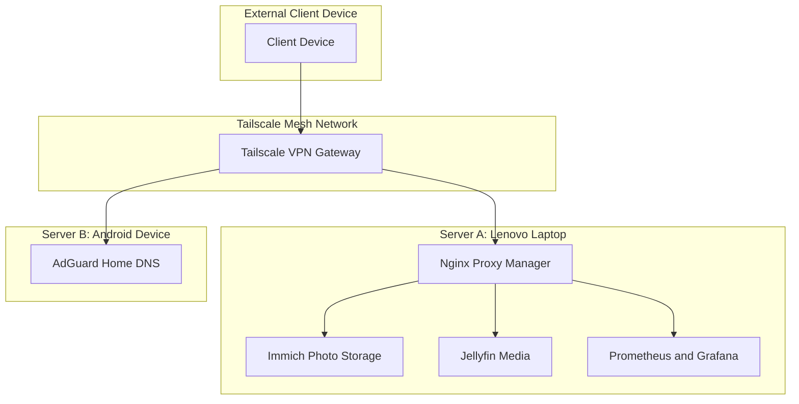
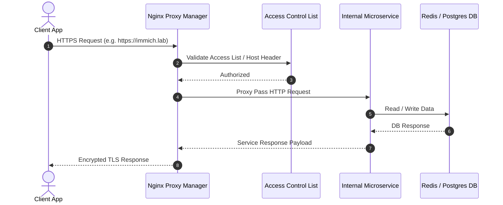

Architecture Overview Design

# System Architecture & Topology

High-level architecture overview of the dual-server homelab setup utilizing **Arch Linux**, **Proxmox VE**, **Android Termux**, and **Tailscale Zero Trust**.

---

## Architectural Diagram

---

## Network & Traffic Flow

Traffic entering the network is routed via **Tailscale Encrypted Mesh** to **Nginx Proxy Manager**, which terminates SSL certificates and routes connections to internal containers.

---

## Service Layer Sequence Diagram

---

## Component Roles

### 1. Server A (Lenovo Arch Linux / Proxmox VE)
- **Primary Compute Host**: Runs Docker engine and LXC containers for resource-heavy workloads (Immich AI indexing, Jellyfin transcoding, Prometheus metrics).
- **SSL Termination**: Nginx Proxy Manager handles Let's Encrypt certificates and internal domain mapping (`*.lab`).

### 2. Server B (Android Termux)
- **Always-On Low Power Node**: Handles lightweight, high-uptime core services such as **AdGuard Home DNS** and secondary network monitoring.
- **Failover Node**: Acts as a backup gateway in the Tailscale mesh.
