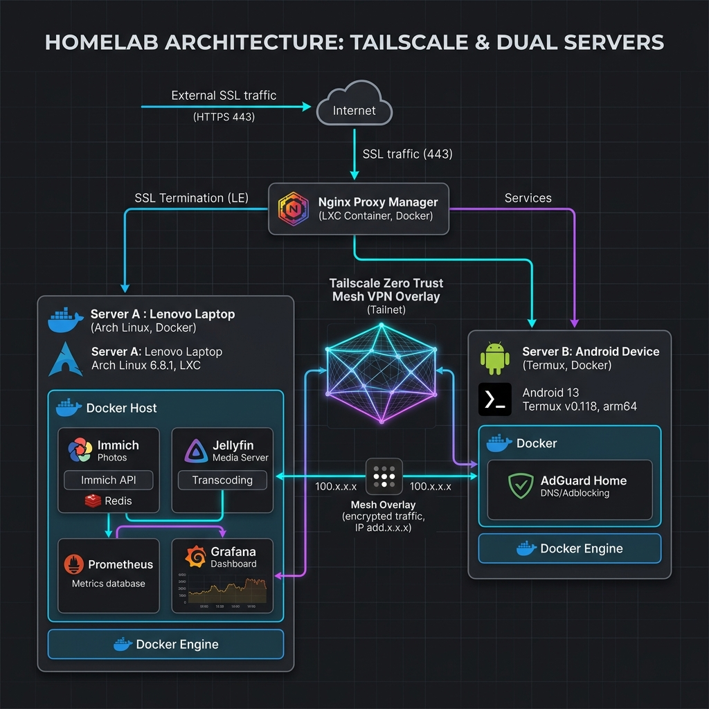

Docs Home

# Welcome to my personal documentation

Centralized documentation for my Homelab, OS setup and infrastructure design.  
This website grows per my convenience. I hope it may be useful to you too.

---

## System Architecture

---

## Service Listing

!!! info "Info"
    This section links services deployed in the homelab environment.  
    Ticked options indicate services configured for high availability.

!!! warning "Warning"
    For latest configuration files and docker compose definitions, visit my [GitHub](https://github.com/Terrich-hash/homelab).

??? info "Bare Metal & Container Services"

    * **Networking & Reverse Proxy**
        - [x] Nginx Proxy Manager (SSL / Reverse Proxy)
        - [x] AdGuard Home DNS
        - [x] Cloudflare Tunnel
        - [x] Shadowsocks Proxy
        - [x] Tailscale Zero Trust Mesh

    * **Media & Storage**
        - [x] Immich Photo Storage
        - [x] Jellyfin Media Server
        - [x] Plex Media Server

    * **Management & Monitoring**
        - [x] Prometheus & Grafana Monitoring
        - [x] Uptime Kuma Status Monitor
        - [x] Sophia Radar

---

## Overview

This documentation describes a **dual-server self-hosted homelab**:
* **Lenovo laptop running Arch Linux**
* **Android device running Linux via Termux**

### Key Objectives
- Zero cloud dependency
- Private, encrypted access
- Hands-on learning of Linux, networking, and infrastructure design
- High-stability services without public IP exposure

This setup follows **zero-trust principles** and a **Tailscale-only access model**.
