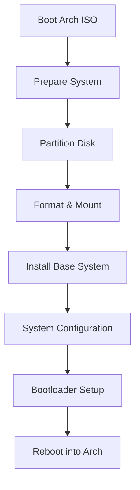
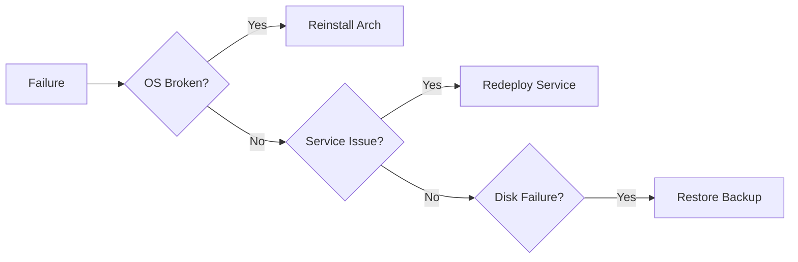

<span class="doc-pill">Arch Linux</span> <span class="doc-pill">Installation</span> <span class="doc-pill">Guide</span>

# Arch Linux Manual Installation

This document describes a pure CLI-based Arch Linux installation for servers and homelabs.

- No GUI
- No installer scripts
- No shortcuts
- Everything is explicit and reproducible

!!! info "Info"
    Follow these instructions carefully when performing a fresh bare-metal Arch Linux installation.

---

## Why Manual Install?
- Learn Linux internals
- Minimal system footprint
- Full control over packages and services

---

## Steps Overview

1. Boot ISO
2. Partition disk
3. Mount filesystems
4. Install base
5. Install bootloader
6. Create users



---

## Step 1 — Boot & Preparation

Boot using the official Arch Linux ISO.

Verify UEFI mode:

```bash
ls /sys/firmware/efi/efivars
```

Enable NTP and set keyboard layout:

```bash
loadkeys us
timedatectl set-ntp true
```

---

## Step 2 — Disk Partitioning (CLI)

List available disks:

```bash
lsblk
```

Example Partition Scheme:
```
Disk: /dev/sda
├─ EFI   512 MB   FAT32   /boot
└─ Root  Remaining  ext4  /
```

Partition using **cfdisk**:
```bash
cfdisk /dev/sda
```

Create:
- EFI System Partition (`/dev/sda1`)
- Linux filesystem partition (`/dev/sda2`)

---

## Step 3 — Format & Mount

```bash
mkfs.fat -F32 /dev/sda1
mkfs.ext4 /dev/sda2

mount /dev/sda2 /mnt
mkdir /mnt/boot
mount /dev/sda1 /mnt/boot
```

---

## Step 4 — Install Base System

```bash
pacstrap /mnt base linux linux-firmware vim sudo
```

Generate **fstab**:
```bash
genfstab -U /mnt >> /mnt/etc/fstab
```

Chroot into system:

```bash
arch-chroot /mnt
```

---

## Step 5 — Core Configuration

Timezone & Clock:
```bash
ln -sf /usr/share/zoneinfo/UTC /etc/localtime
hwclock --systohc
```

Locale setup:
```bash
vim /etc/locale.gen
```

Uncomment `en_US.UTF-8 UTF-8` in `/etc/locale.gen`, then generate:
```bash
locale-gen
echo "LANG=en_US.UTF-8" > /etc/locale.conf
```

---

## Step 6 — Networking (CLI)

Install NetworkManager:
```bash
pacman -S networkmanager
systemctl enable NetworkManager
```

!!! note "Note"
    NetworkManager is used for stable CLI networking and recovery.

---

## Step 7 — Users & Privileges

Set root password:
```bash
passwd
```

Create admin user:
```bash
useradd -m -G wheel terrich
passwd terrich
```

Enable sudo:
```bash
EDITOR=vim visudo
```

Uncomment:
```
%wheel ALL=(ALL:ALL) ALL
```

---

## Step 8 — Bootloader (systemd-boot, CLI)

Install bootloader:
```bash
bootctl install
```

Edit `/boot/loader/loader.conf`:
```ini
default arch
timeout 3
editor no
```

Create boot entry `/boot/loader/entries/arch.conf`:
```ini
title   Arch Linux
linux   /vmlinuz-linux
initrd  /initramfs-linux.img
options root=UUID=<ROOT_UUID> rw
```

Get root UUID using `blkid`.

---

## Step 9 — Reboot

```bash
exit
umount -R /mnt
reboot
```

---

## Maintenance & Recovery

### Maintenance Policy (CLI)

System Updates:
```bash
pacman -Syu
```

Rules:
- Update regularly
- Read output carefully
- Never interrupt upgrades

### Failure Handling Model



!!! danger "Recovery Rule"
    System failures must result in automated redeployment, not manual patching.
