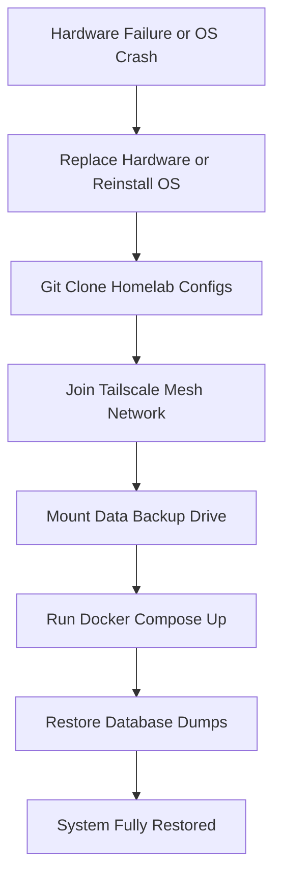

<span class="doc-pill">Maintenance</span> <span class="doc-pill">Disaster Recovery</span> <span class="doc-pill">Backups</span>

# Disaster Recovery & Backup Strategy

Disaster recovery protocols for restoring server hosts, Docker container volumes, and network routing in the event of hardware failure.

---

## Recovery Workflow



---

## 3-2-1 Backup Strategy

- **3 Copies of Data**: Active production data, local backup drive, offsite cloud backup.
- **2 Different Media**: NVMe SSD + ZFS HDD volume.
- **1 Offsite Location**: Encrypted Restic backup pushed to Backblaze B2 / Tailscale remote node.

---

## Disaster Recovery Commands

```bash
# 1. Restore Docker Volumes from Restic Repository
restic -r b2:my-homelab-backups restore latest --target /mnt/storage

# 2. Restore PostgreSQL Database Dump
cat immich_backup.sql | docker exec -i immich_postgres psql -U postgres -d immich

# 3. Spin up all Services
docker compose up -d
```
