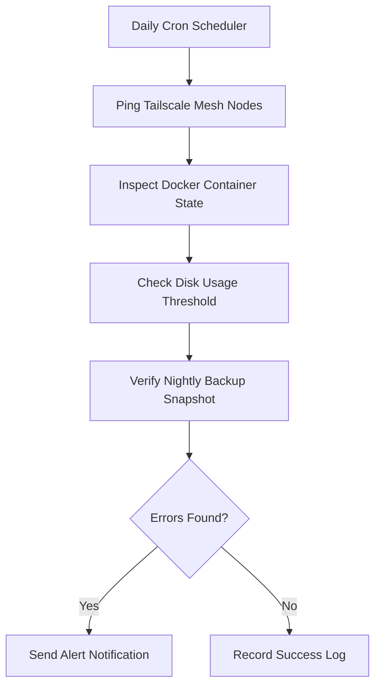

<span class="doc-pill">Maintenance</span> <span class="doc-pill">Health Checks</span> <span class="doc-pill">Monitoring</span>

# Routine Health Checks & Monitoring Policy

Standard operating procedures for maintaining homelab stability, verifying backup integrity, and monitoring node health.

---

## Daily Automated Health Checks



---

## Health Check Script (`health-check.sh`)

```bash
#!/bin/bash
# Homelab Automated Health Verification

echo "Checking Tailscale Connectivity..."
tailscale status || exit 1

echo "Checking Unhealthy Docker Containers..."
UNHEALTHY=$(docker ps -a --filter health=unhealthy -q)
if [ -n "$UNHEALTHY" ]; then
    echo "Warning: Unhealthy containers detected: $UNHEALTHY"
fi

echo "Checking Disk Space..."
df -h | grep -E '/dev/sd|/dev/nvme'
```