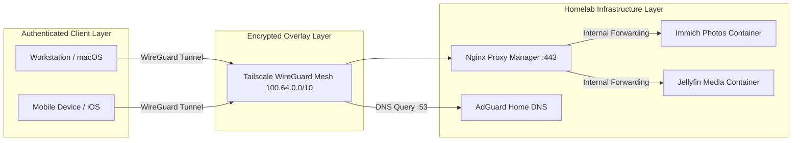

Networking Basics Principles

# Networking Basics & Core Architectural Principles

This document defines the foundational networking principles, threat modeling assumptions, and traffic rules governing all nodes and services across the homelab infrastructure.

---

## Architectural Principles Visual Diagram

---

## Core Principles Detailed Breakdown

### 1. No Public Exposure by Default (Default-Deny Ingress)
- **Zero Open WAN Ports**: The home gateway router operates under a strict `default-deny` inbound policy. No TCP/UDP ports (80, 443, 22) are forwarded from the public IP address.
- **Port Scanner Immunity**: By eliminating public listeners, the infrastructure remains invisible to automated Internet-wide port scanners (such as Shodan, Censys, and Masscan).
- **CGNAT Compatibility**: The network functions independently of ISP-assigned dynamic IPv4 addresses or Carrier-Grade NAT (CGNAT) restrictions.

Public access is treated as an **audited exception**, never the default operating mode.

---

### 2. Private Network First (Overlay Space)
- **Carrier-Grade NAT Allocation**: All internal communication routes through the `100.64.0.0/10` private overlay IP space managed by Tailscale.
- **Split-Horizon Resolution**: Internal domains (`*.lab` / `*.homelab.net`) resolve exclusively inside the private mesh and cannot be queried or resolved by public DNS resolvers.
- **Interface Binding Scoping**: Application microservices bind specifically to private mesh interfaces (`100.x.y.z`) or `127.0.0.1`, preventing accidental exposure to local physical LAN segments.

---

### 3. Cryptographic Identity Over Source IP
Traditional network security relies on IP-based firewall rules (`allow 192.168.1.50`). This architecture replaces location trust with **cryptographic identity**:

- **Device Verification**: Every participating host authenticates using public/private key pairs built on the Curve25519 elliptic curve.
- **User Authentication**: User identity is validated through single sign-on (SSO) providers with mandatory Multi-Factor Authentication (MFA).
- **Session Scoping**: Network privileges follow the authenticated identity, regardless of whether the device is connected to home Wi-Fi or roaming on cellular data.

---

### 4. Failure Resilience & Fault Isolation
Systems are engineered under the assumption that external network paths and overlay links will experience transient failures:

- **State Offline Operation**: Internal nodes continue processing local tasks (e.g., ZFS snapshots, local media streaming) even if external internet uplink drops.
- **Data Persistence Scoping**: Persistent application state is isolated in `/srv` and mounted ZFS pools, ensuring that OS reinstallation or network reconfiguration never corrupts database volumes.

---

## Traffic Flow Architecture

