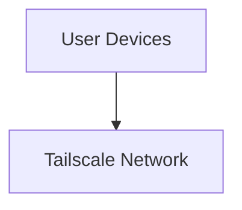
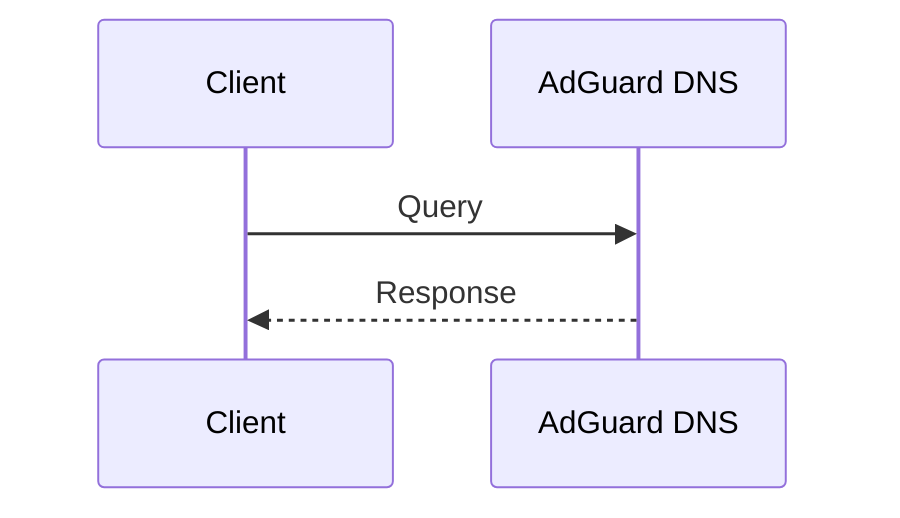

# 🌐 Network Diagrams

## Full Architecture

    Tailscale --> Lenovo[Lenovo Server]
    Tailscale --> Android[Android (Termux)]

    Lenovo --> Immich[Immich]
    Lenovo --> Jellyfin[Jellyfin]
    Lenovo --> Plex[Plex]

    Android --> DNS[AdGuard DNS]

## DNS Request Flow

### Rationale

This is a **security-first design choice**, not a failure mode.

- Public exposure increases attack surface
- Tailscale provides identity-based access control
- Availability is traded for security by design

### Failure model

> If Tailscale is unavailable:
>
> - Services remain running
> - Data remains safe
> - External access is blocked by design
>
> Restoring access requires restoring Tailscale, not reconfiguring services.
