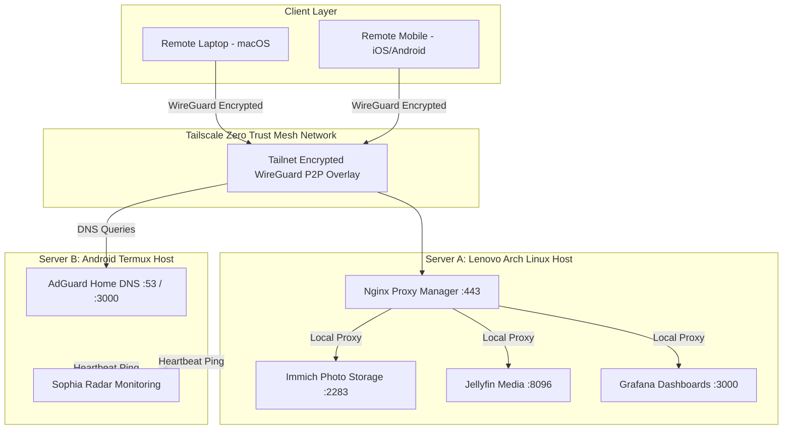
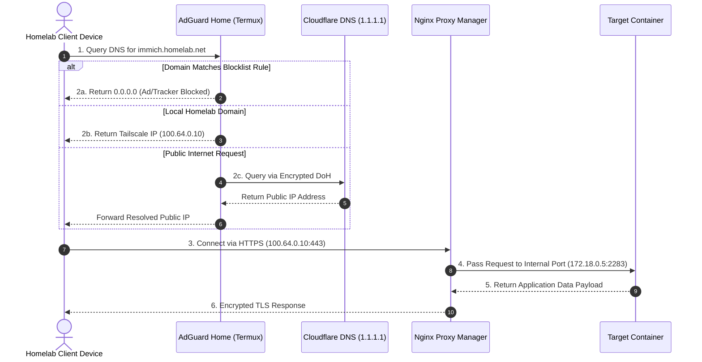

Networking Diagrams Topology

# Network Topology & Visual Layouts

Comprehensive architectural breakdown, node interconnectivity matrices, and DNS resolution diagrams for the homelab network.

---

## Homelab System Topology Visual Diagram

---

## Topology Analysis & Node Responsibilities

### 1. Primary Compute Node (Server A - Lenovo Arch Linux)
- **Role**: High-capacity compute, media transcoding, AI indexing, and reverse proxy ingress.
- **Network Interface**: Dual physical Ethernet + Tailscale Mesh interface (`100.64.0.10`).
- **Core Workloads**:
  - **Nginx Proxy Manager**: Handles central ingress, SSL certificate termination, and HTTP/2 proxying.
  - **Immich Stack**: Handles photo indexing, machine learning background workers, and PostgreSQL database.
  - **Jellyfin & Plex**: Media streaming engines with VAAPI hardware acceleration pass-through.
  - **Prometheus & Grafana**: System telemetry collection and visualization.

### 2. Low-Power Infrastructure Node (Server B - Android Termux)
- **Role**: Continuous low-power infrastructure support and primary DNS resolution.
- **Network Interface**: Wi-Fi / USB Ethernet tethering + Tailscale Mesh interface (`100.64.0.11`).
- **Core Workloads**:
  - **AdGuard Home**: Primary DNS resolver providing ad blocking, malware domain filtering, and local DNS overrides.
  - **Sophia Radar**: Continuous uptime and heartbeat checker monitoring network health.

---

## IP Addressing & Subnet Matrix

| Node / Interface | Host OS | Subnet / IP Range | Access Type | Managed Services |
| :--- | :--- | :--- | :--- | :--- |
| **Server A Host** | Arch Linux | `100.64.0.10/32` | Tailscale P2P | Docker Engine, Host SSH |
| **Server B Host** | Android Termux | `100.64.0.11/32` | Tailscale P2P | Termux SSH, DNS Server |
| **Docker Bridge A** | Linux Bridge | `172.18.0.0/16` | Internal Docker | NPM, Immich, Jellyfin, Grafana |
| **Docker Bridge B** | Linux Bridge | `172.19.0.0/16` | Internal Docker | AdGuard Home, Telemetry Collectors |

---

## Interactive Topology Flowchart

```mermaid
flowchart TB
    subgraph Clients [Client Layer]
        RemoteLaptop[Remote Laptop - macOS]
        RemotePhone[Remote Mobile - iOS/Android]
    end

    subgraph MeshNetwork [Tailscale Zero Trust Mesh Network]
        Tailnet[Tailnet Encrypted WireGuard P2P Overlay]
    end

    subgraph ServerA [Server A: Lenovo Arch Linux Host]
        NPM[Nginx Proxy Manager :443]
        Immich[Immich Photo Storage :2283]
        Jellyfin[Jellyfin Media :8096]
        Grafana[Grafana Dashboards :3000]
    end

    subgraph ServerB [Server B: Android Termux Host]
        AdGuard[AdGuard Home DNS :53 / :3000]
        Sophia[Sophia Radar Monitoring]
    end

    RemoteLaptop -->|WireGuard Encrypted| Tailnet
    RemotePhone -->|WireGuard Encrypted| Tailnet
    Tailnet --> NPM
    NPM -->|Local Proxy| Immich
    NPM -->|Local Proxy| Jellyfin
    NPM -->|Local Proxy| Grafana
    Tailnet -->|DNS Queries| AdGuard
    ServerA -.->|Heartbeat Ping| Sophia
    ServerB -.->|Heartbeat Ping| Sophia
```

---

## DNS Query Resolution Sequence

```mermaid
sequenceDiagram
    autonumber
    actor Client as Homelab Client Device
    participant AdGuard as AdGuard Home (Termux)
    participant Upstream as Cloudflare DNS (1.1.1.1)
    participant NPM as Nginx Proxy Manager
    participant App as Target Container

    Client->>AdGuard: 1. Query DNS for immich.homelab.net
    alt Domain Matches Blocklist Rule
        AdGuard-->>Client: 2a. Return 0.0.0.0 (Ad/Tracker Blocked)
    else Local Homelab Domain
        AdGuard-->>Client: 2b. Return Tailscale IP (100.64.0.10)
    else Public Internet Request
        AdGuard->>Upstream: 2c. Query via Encrypted DoH
        Upstream-->>AdGuard: Return Public IP Address
        AdGuard-->>Client: Forward Resolved Public IP
    end

    Client->>NPM: 3. Connect via HTTPS (100.64.0.10:443)
    NPM->>App: 4. Pass Request to Internal Port (172.18.0.5:2283)
    App-->>NPM: 5. Return Application Data Payload
    NPM-->>Client: 6. Encrypted TLS Response
```
