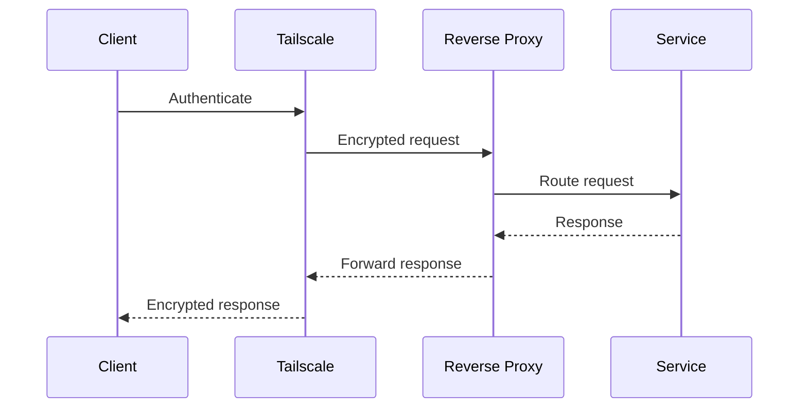

# 🔁 Reverse Proxy Explained
## Problem
One IP, many services.

## Solution
Reverse proxy routes traffic internally.

## Tool Used
Nginx Proxy Manager

# 🔁 Reverse Proxy Architecture

The reverse proxy is used for **internal service routing**, not public exposure.

It simplifies access **inside the private network** while maintaining strict access controls.

---

## Why a Reverse Proxy?
- Single entry point for multiple services
- Centralized TLS handling
- Cleaner URLs (no ports)
- Easier service management

The reverse proxy improves **usability**, not accessibility.

---

##  Design Rule: Reverse Proxy Scope

!!! danger "Internal Use Only"
    The reverse proxy **must never be publicly exposed**.

    - It listens only on private interfaces
    - It is accessible only via **Tailscale**
    - It does not replace firewall or access controls

If the reverse proxy becomes public, **the design is broken**.

---

## 🔐 Access Model

All access follows this path:

