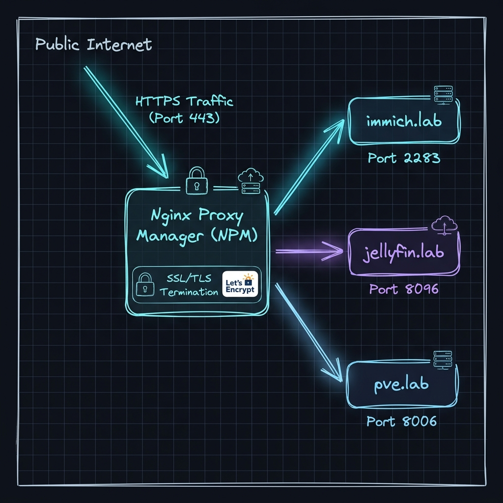
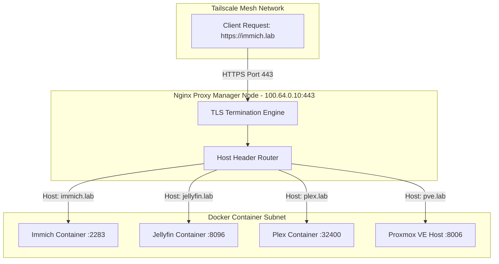
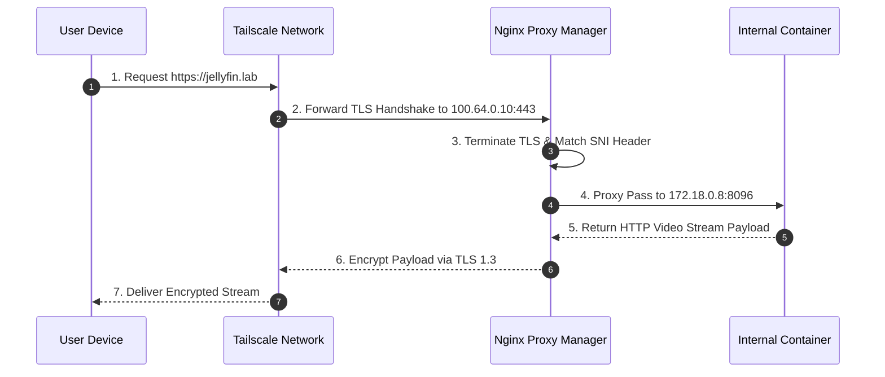

<span class="doc-pill">Networking</span> <span class="doc-pill">Reverse Proxy</span> <span class="doc-pill">Nginx</span>

# Reverse Proxy Architecture & TLS Termination

Detailed technical guide to the internal Nginx reverse proxy architecture, domain routing mechanics, and security header enforcement.

---

## Reverse Proxy Architecture Visual Diagram



---

## Core Problem & Reverse Proxy Solution

### 1. The Challenge: Single IP & Port Conflicts
In a self-hosted environment, multiple web services (Immich, Jellyfin, Proxmox VE, Grafana) run on different internal container ports (`2283`, `8096`, `8006`, `3000`). Forcing users to remember IP-and-port combinations (`100.64.0.10:8096`) leads to poor usability, lacks automatic TLS encryption, and creates security overhead.

### 2. The Solution: Nginx Proxy Manager Ingress
Nginx Proxy Manager acts as a centralized HTTP/HTTPS reverse proxy that:
- Listens on standard HTTPS port `443` bound to the private Tailscale interface (`100.64.0.10`).
- Inspects the incoming Server Name Indication (SNI) host header (e.g., `immich.lab`).
- Terminates SSL/TLS encryption centrally.
- Proxy-passes the unencrypted or internal HTTP request to the designated container target (`172.18.0.5:2283`).

---

## Technical Features & Security Benefits

### A. Centralized Let's Encrypt TLS Management
- **Automated Issuance**: Obtains SSL/TLS certificates automatically via Let's Encrypt.
- **Cloudflare DNS-01 Challenge**: Certificates are issued using DNS API validation, allowing Let's Encrypt to verify domain ownership without requiring open inbound ports 80 or 443 on public routers.

### B. Header Injection & WebSockets Support
Nginx injects necessary proxy headers to inform backend containers of the real client IP and protocol:

```nginx
# Core Reverse Proxy Headers
proxy_set_header Host $host;
proxy_set_header X-Real-IP $remote_addr;
proxy_set_header X-Forwarded-For $proxy_add_x_forwarded_for;
proxy_set_header X-Forwarded-Proto $scheme;

# WebSocket Proxy Pass Setup (Immich / Jellyfin Sync)
proxy_set_header Upgrade $http_upgrade;
proxy_set_header Connection "upgrade";
proxy_http_version 1.1;
```

### C. Security Hardening Policies
- **Strict Transport Security (HSTS)**: Forces all client browsers to use HTTPS for subsequent requests (`max-age=31536000`).
- **X-Frame-Options (SAMEORIGIN)**: Protects web applications against clickjacking attacks.
- **X-Content-Type-Options (nosniff)**: Prevents MIME-type sniffing vulnerabilities.

---

## Reverse Proxy Routing Architecture


```mermaid
flowchart TD
    subgraph IngressLayer [Tailscale Mesh Network]
        Client[Client Request: https://immich.lab]
    end

    subgraph ProxyNode [Nginx Proxy Manager Node - 100.64.0.10:443]
        TLS[TLS Termination Engine]
        SNIRouter[Host Header Router]
    end

    subgraph InternalContainers [Docker Container Subnet]
        Immich[Immich Container :2283]
        Jellyfin[Jellyfin Container :8096]
        Plex[Plex Container :32400]
        Proxmox[Proxmox VE Host :8006]
    end

    Client -->|HTTPS Port 443| TLS
    TLS --> SNIRouter
    SNIRouter -->|Host: immich.lab| Immich
    SNIRouter -->|Host: jellyfin.lab| Jellyfin
    SNIRouter -->|Host: plex.lab| Plex
    SNIRouter -->|Host: pve.lab| Proxmox
```

---

## Proxy Request Sequence


```mermaid
sequenceDiagram
    autonumber
    participant Client as User Device
    participant TS as Tailscale Network
    participant NPM as Nginx Proxy Manager
    participant App as Internal Container

    Client->>TS: 1. Request https://jellyfin.lab
    TS->>NPM: 2. Forward TLS Handshake to 100.64.0.10:443
    NPM->>NPM: 3. Terminate TLS & Match SNI Header
    NPM->>App: 4. Proxy Pass to 172.18.0.8:8096
    App-->>NPM: 5. Return HTTP Video Stream Payload
    NPM-->>TS: 6. Encrypt Payload via TLS 1.3
    TS-->>Client: 7. Deliver Encrypted Stream
```