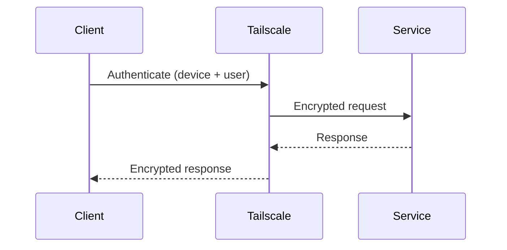

# 🔒 Tailscale-Only Architecture

All external access to the homelab is **strictly limited to Tailscale**.

There are **no public-facing services**.

---

## Why Tailscale?
- No port forwarding
- End-to-end encrypted traffic
- Identity-based access control
- Works behind NAT and CGNAT
- Simple device-level authentication

Tailscale is the **single ingress layer** for the entire network.

---

##  Design Rule: Network Access

!!! danger "Intentional Access Restriction"
    All services are **only accessible via Tailscale**.

    If Tailscale is unavailable:
    - Access is **intentionally blocked**
    - No public fallback exists
    - No ports are exposed to the internet

This is **by design**, not a failure.

---

## 🔁 Failure Model

> Tailscale downtime is treated as a **security state**, not an outage.

- Services continue running internally
- Data remains safe and unchanged
- External access is denied by default

Restoring access requires restoring **Tailscale**,  
**not** reconfiguring routers, firewalls, or services.

---

## 🌐 Access Flow

