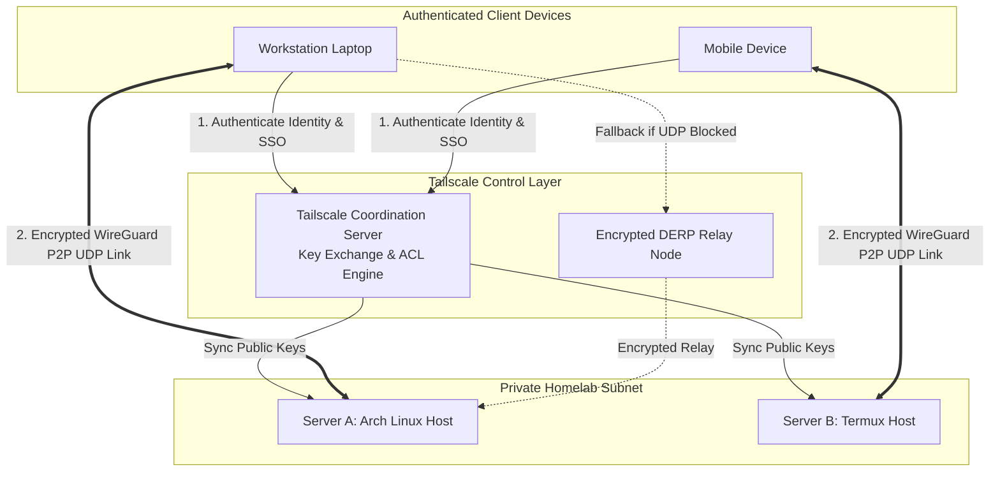
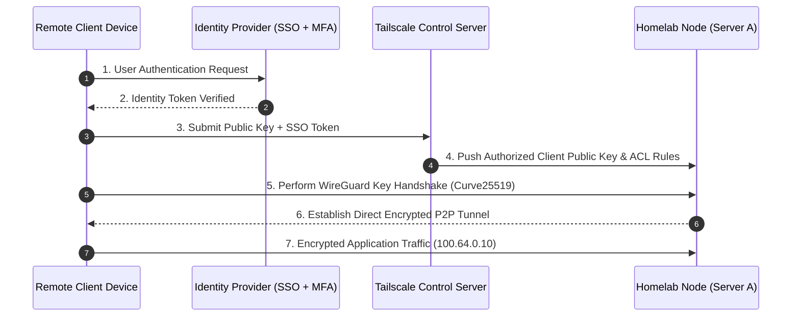

Networking Tailscale Zero Trust

# Tailscale-Only Ingress Architecture

Comprehensive technical guide detailing the Tailscale-only access model, WireGuard P2P mesh encapsulation, NAT traversal mechanisms, and security policy.

---

## Tailscale Ingress Visual Diagram

---

## Technical Deep-Dive: How Tailscale Secures Ingress

### 1. WireGuard Encryption & Key Exchange
Tailscale is built directly on top of the modern **WireGuard** VPN protocol. Every node in the homelab generates a unique Curve25519 public/private key pair:
- Private keys **never leave the host node**.
- Public keys are synchronized through Tailscale's control plane.
- Data packets are authenticated and encrypted using ChaCha20-Poly1305.

### 2. NAT Traversal & DERP Relays
Most home ISPs place connections behind symmetric NAT or Carrier-Grade NAT (CGNAT), preventing traditional incoming VPN connections. Tailscale solves this using **STUN (Session Traversal Utilities for NAT)** and **ICE (Interactive Connectivity Establishment)**:
- **Direct P2P Link**: Over 90% of connections establish direct peer-to-peer UDP links between client and homelab nodes over port `41641`.
- **DERP Relays**: If direct UDP communication is blocked by restrictive firewalls, traffic routes through encrypted DERP (Detoured Encrypted Routing Protocol) relay servers. DERP nodes **cannot read payload data** because traffic remains end-to-end encrypted with host keys.

### 3. MagicDNS & Split-Horizon Resolution
Tailscale MagicDNS automatically maps node hostnames (`server-a.tailnet.ts.net`) to private `100.64.0.0/10` overlay IP addresses. Combined with AdGuard Home, all homelab services resolve seamlessly without public DNS records exposing internal IP addresses.

---

## Security Model & Resilience Strategy

!!! danger "Security Failure Mode: Deny-by-Default"
    If Tailscale connectivity is interrupted or disabled:
    - Ingress access to all services is **intentionally blocked**.
    - No fallback public endpoints exist.
    - No router ports are opened as emergency backups.

Downtime is treated as a **protected security state**. Restoring service connectivity requires restoring the Tailscale control link, eliminating the risk of exposure during network maintenance.

---

## Tailscale Mesh Connectivity Flowchart

```mermaid
flowchart TD
    subgraph ClientNodes [Authenticated Client Devices]
        Laptop[Workstation Laptop]
        Mobile[Mobile Device]
    end

    subgraph ControlPlane [Tailscale Control Layer]
        Coordination[Tailscale Coordination Server<br/>Key Exchange & ACL Engine]
        DERP[Encrypted DERP Relay Node]
    end

    subgraph HomelabMesh [Private Homelab Subnet]
        NodeA[Server A: Arch Linux Host]
        NodeB[Server B: Termux Host]
    end

    Laptop -->|1. Authenticate Identity & SSO| Coordination
    Mobile -->|1. Authenticate Identity & SSO| Coordination
    Coordination -- Sync Public Keys --> NodeA
    Coordination -- Sync Public Keys --> NodeB

    Laptop <===>|2. Encrypted WireGuard P2P UDP Link| NodeA
    Mobile <===>|2. Encrypted WireGuard P2P UDP Link| NodeB
    Laptop -.->|Fallback if UDP Blocked| DERP
    DERP -.->|Encrypted Relay| NodeA
```

---

## Authentication Sequence Diagram

```mermaid
sequenceDiagram
    autonumber
    participant Client as Remote Client Device
    participant SSO as Identity Provider (SSO + MFA)
    participant Tailnet as Tailscale Control Server
    participant ServerA as Homelab Node (Server A)

    Client->>SSO: 1. User Authentication Request
    SSO-->>Client: 2. Identity Token Verified
    Client->>Tailnet: 3. Submit Public Key + SSO Token
    Tailnet->>ServerA: 4. Push Authorized Client Public Key & ACL Rules
    Client->>ServerA: 5. Perform WireGuard Key Handshake (Curve25519)
    ServerA-->>Client: 6. Establish Direct Encrypted P2P Tunnel
    Client->>ServerA: 7. Encrypted Application Traffic (100.64.0.10)
```