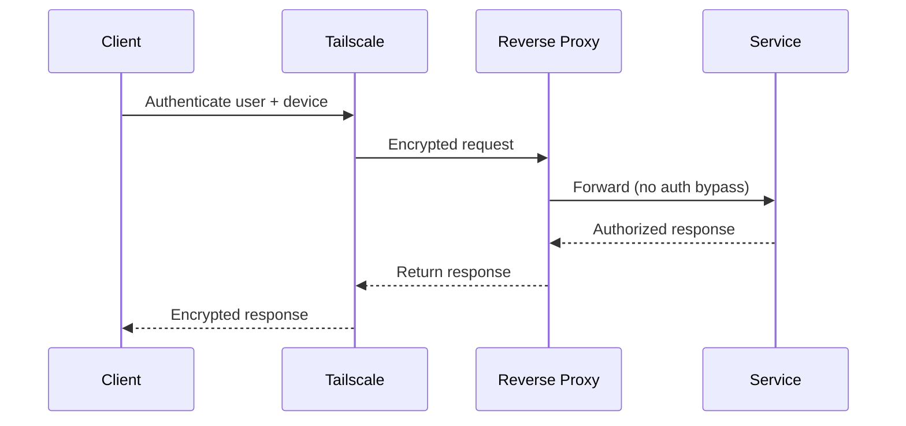

# 🛡️ Zero Trust Model

This homelab follows a **Zero Trust security model**.

No device, service, or network is trusted by default —  
**every request must prove identity and authorization.**

---

## Core Principles

### 1. Never Trust the Network
- LAN is not trusted
- Wi-Fi is not trusted
- Physical location is not trusted

Network access alone **does not grant access to services**.

---

### 2. Verify Identity for Every Connection
Access is based on:
- Authenticated **users**
- Authenticated **devices**
- Explicit **service permissions**

Identity is required **before** any service interaction.

---

### 3. Minimize Blast Radius
- Services are isolated
- Nodes are disposable
- No shared credentials
- No broad network access

Compromise of one component must **not** expose others.

---

##  Enforcement Layers

Zero Trust is enforced through **multiple independent layers**.

| Layer | Enforcement |
|----|-----------|
| Network access | Tailscale authentication |
| Device trust | Tailscale device identity |
| Service routing | Internal reverse proxy |
| Data access | Service-level authentication |
| Storage | Off-device persistence |

No single layer is sufficient on its own.

---

## 🌐 Request Flow (Zero Trust in Action)

