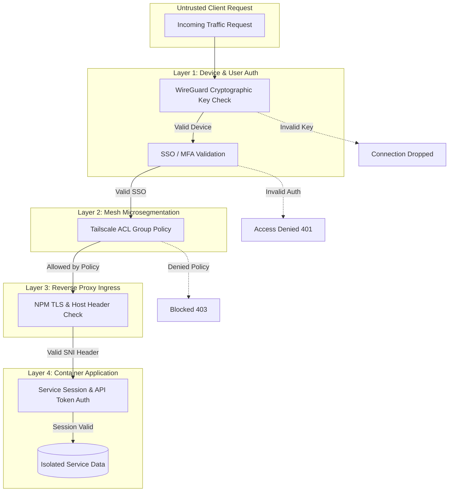
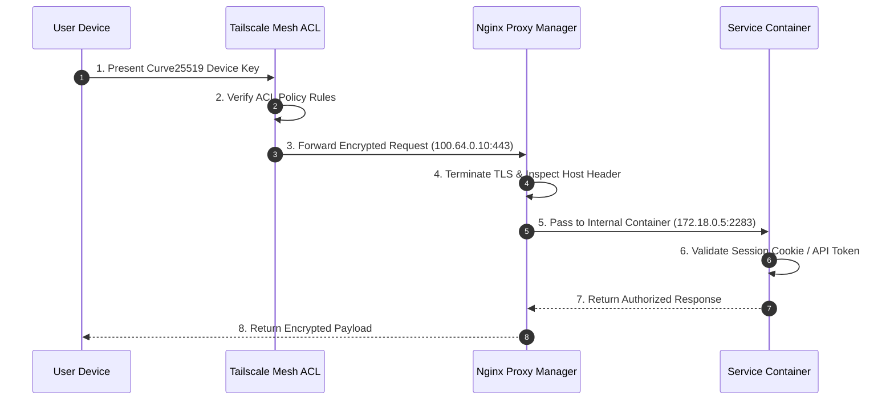

Networking Zero Trust Security

# Zero Trust Security Architecture

Complete guide to the Zero Trust security model, defense-in-depth enforcement layers, container microsegmentation, and request validation policies.

---

## Zero Trust Security Layers Visual Diagram

---

## Core Zero Trust Principles

### 1. Never Trust the Network Location
Physical connection to home Wi-Fi or LAN does **not** grant access privileges to internal homelab services. Every incoming connection is treated as originating from an untrusted public network.

### 2. Explicit Verification for Every Request
Access decisions require two-factor identity proof:
- **Device Identity**: Validated via ephemeral WireGuard key pairs tied to approved hardware.
- **User Identity**: Validated via SSO authentication with mandatory Multi-Factor Authentication (MFA).

### 3. Least Privilege & Blast Radius Minimization
If a single container or service is compromised, microsegmentation prevents lateral movement across host networks or adjacent container volumes:
- Containers run in isolated Docker bridges (`172.18.0.0/16`).
- Containers use unprivileged system users (`PUID=1000`, `PGID=1000`).
- Root filesystems are set to read-only where applicable.

---

## 4-Layer Defense-in-Depth Model

| Security Layer | Technology Stack | Security Function |
| :--- | :--- | :--- |
| **Layer 1: Device Auth** | Tailscale Device Keys + MFA SSO | Validates hardware signature & user credentials before tunnel creation |
| **Layer 2: ACL Segmentation** | Tailscale Tailnet ACL Policies | Restricts traffic flow between tagged groups (`tag:server`, `tag:client`) |
| **Layer 3: Ingress Proxy** | Nginx Proxy Manager (NPM) | Handles TLS termination, SNI matching, URL path filtering, and rate limiting |
| **Layer 4: Container Isolation** | Linux Namespaces & Cgroups | Restricts process capabilities, filesystem access, and system calls |

---

## Zero Trust Validation Flowchart

```mermaid
flowchart TD
    subgraph ClientLayer [Untrusted Client Request]
        Request[Incoming Traffic Request]
    end

    subgraph Layer1 [Layer 1: Device & User Auth]
        DeviceCheck[WireGuard Cryptographic Key Check]
        SSOCheck[SSO / MFA Validation]
    end

    subgraph Layer2 [Layer 2: Mesh Microsegmentation]
        ACLCheck[Tailscale ACL Group Policy]
    end

    subgraph Layer3 [Layer 3: Reverse Proxy Ingress]
        NPMCheck[NPM TLS & Host Header Check]
    end

    subgraph Layer4 [Layer 4: Container Application]
        AppAuth[Service Session & API Token Auth]
        ContainerData[(Isolated Service Data)]
    end

    Request --> DeviceCheck
    DeviceCheck -->|Valid Device| SSOCheck
    DeviceCheck -.->|Invalid Key| Drop1[Connection Dropped]
    SSOCheck -->|Valid SSO| ACLCheck
    SSOCheck -.->|Invalid Auth| Drop2[Access Denied 401]
    ACLCheck -->|Allowed by Policy| NPMCheck
    ACLCheck -.->|Denied Policy| Drop3[Blocked 403]
    NPMCheck -->|Valid SNI Header| AppAuth
    AppAuth -->|Session Valid| ContainerData
```

---

## Request Validation Sequence Diagram

```mermaid
sequenceDiagram
    autonumber
    participant Client as User Device
    participant Tailscale as Tailscale Mesh ACL
    participant NPM as Nginx Proxy Manager
    participant App as Service Container

    Client->>Tailscale: 1. Present Curve25519 Device Key
    Tailscale->>Tailscale: 2. Verify ACL Policy Rules
    Tailscale->>NPM: 3. Forward Encrypted Request (100.64.0.10:443)
    NPM->>NPM: 4. Terminate TLS & Inspect Host Header
    NPM->>App: 5. Pass to Internal Container (172.18.0.5:2283)
    App->>App: 6. Validate Session Cookie / API Token
    App-->>NPM: 7. Return Authorized Response
    NPM-->>Client: 8. Return Encrypted Payload
```