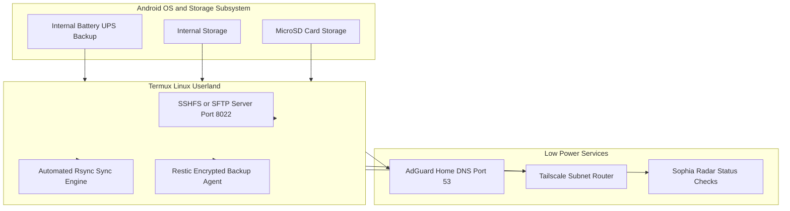

<span class="doc-pill">Android Host</span> <span class="doc-pill">Termux</span> <span class="doc-pill">Fileserver</span>

# Android Termux Server (Server B) & Backup Fileserver

An Android smartphone repurposed as an ultra-low-power, battery-backed secondary Linux server running **Termux** for lightweight fileserver tasks, automated background syncing, and core DNS infrastructure.

---

## Server & Storage Architecture



---

## Storage Setup & Permissions

To allow Termux to access shared Android internal storage and external MicroSD cards:

```bash
# Request storage permission prompt in Android OS
termux-setup-storage

# Verify created storage symlinks (~/storage)
ls -la ~/storage
# dcim -> /sdcard/DCIM
# downloads -> /sdcard/Download
# shared -> /sdcard
# external-1 -> /storage/XXXX-XXXX (MicroSD)
```

---

## SFTP / SSHFS Fileserver Setup (`:8022`)

Termux includes OpenSSH, serving as an encrypted SFTP fileserver accessible across the Tailscale mesh:

```bash
# Install OpenSSH
pkg update && pkg install openssh -y

# Set SSH password
passwd

# Start SSH / SFTP server listening on port 8022
sshd

# Verify listening port
netstat -tlpn | grep 8022
```

### Client SSHFS Mounting Command (From Workstation)

```bash
# Mount Termux storage onto desktop filesystem via SSHFS over Tailscale
mkdir -p ~/mnt/termux-storage
sshfs -p 8022 u0_a245@100.64.0.11:/sdcard ~/mnt/termux-storage
```

---

## Automated Remote Backup Sync Script (`backup-to-server-a.sh`)

Script running on Server B that periodically syncs critical phone backups and AdGuard configs to Server A (Lenovo Arch Linux):

```bash
#!/data/data/com.termux/files/usr/bin/bash
# Automated Rsync Backup from Server B (Termux) to Server A (Arch Linux)

LOG_FILE="$HOME/backup.log"
TARGET_HOST="100.64.0.10"
TARGET_DIR="/mnt/storage/backups/termux-nodes/"

echo "[$(date)] Starting sync to $TARGET_HOST..." >> "$LOG_FILE"

# Sync AdGuard Home configuration and local backups
rsync -avz -e "ssh -p 22" \
    $HOME/.adguard/ \
    terrich@$TARGET_HOST:$TARGET_DIR/adguard-backup/ >> "$LOG_FILE" 2>&1

if [ $? -eq 0 ]; then
    echo "[$(date)] Sync completed successfully." >> "$LOG_FILE"
else
    echo "[$(date)] Sync failed!" >> "$LOG_FILE"
fi
```
