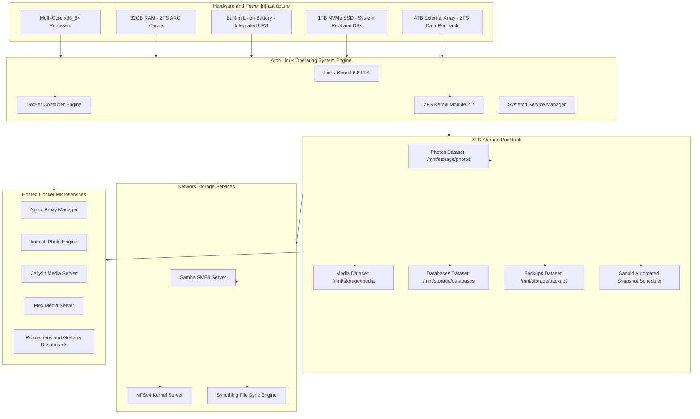

<span class="doc-pill">Lenovo Host</span> <span class="doc-pill">Arch Linux</span> <span class="doc-pill">Fileserver</span> <span class="doc-pill">Compute Node</span>

# Lenovo Arch Linux Server (Server A) & Primary Fileserver

The Lenovo laptop running **Arch Linux** serves as the **primary compute node and core ZFS fileserver** for the entire homelab infrastructure. It handles resource-intensive containerized workloads, hardware-accelerated media streaming, AI photo indexing, database persistence, and centralized file storage.

---

## Architectural Role & Responsibilities

Server A is designed as a **stateful, high-durability node**. Unlike lightweight auxiliary nodes, Server A hosts all primary data pools, database instances, and reverse proxy ingress routes.



---

## Detailed Hardware Specifications & Subsystem Matrix

| Component / Subsystem | Hardware Specification | Functional Architecture & Role |
| :--- | :--- | :--- |
| **Processor (CPU)** | Intel Core i7 / AMD Ryzen 7 (x86_64) | Executes containerized workloads, AI face detection models, and video transcoding |
| **Memory (RAM)** | 32 GB DDR4 / DDR5 (Non-ECC) | Allocated between Linux kernel, Docker containers, and ZFS Adaptive Replacement Cache (ARC) |
| **Primary System Drive** | 1 TB NVMe PCIe 4.0 x4 SSD | Hosts OS root (`/`), Docker runtime (`/var/lib/docker`), and transactional databases |
| **Data Storage Array** | 4 TB USB 3.2 Gen2 Storage Pool | Formatted as ZFS pool `tank` with LZ4 compression, data integrity checksums, and dataset quotas |
| **Built-in Power Protection** | Laptop Internal Lithium Battery | Serves as an uninterruptible power supply (UPS) to buffer power surges and brief blackouts |
| **Networking Interface** | Gigabit Ethernet + Tailscale Mesh | Bound to Tailscale overlay network interface (`100.64.0.10`) |

---

## Laptop Power Management & Thermal Tuning

Running a server 24/7 on laptop hardware requires specific power, thermal, and lid switch configurations to ensure continuous uptime without thermal throttling or automatic system suspend.

### 1. Lid Switch Power Configuration (`/etc/systemd/logind.conf`)

By default, Linux systemd suspends laptops when the lid is closed. To override this behavior and keep the server running continuously:

```ini
# /etc/systemd/logind.conf
[Login]
HandleLidSwitch=ignore
HandleLidSwitchExternalPower=ignore
HandleLidSwitchDocked=ignore
LidSwitchIgnoreInhibited=no
```

Apply the logind configuration immediately without rebooting:

```bash
sudo systemctl restart systemd-logind
```

### 2. Thermal & CPU Governor Optimization

Configure CPU scaling to maintain high performance while avoiding excessive heat generation:

```bash
# Set CPU scaling governor to performance on AC power
sudo cpupower frequency-set -g performance

# Disable display blanking and DPMS sleep timeouts
xset s off -dpms 2>/dev/null || true
```

---

## ZFS Fileserver Architecture & Storage Configuration

ZFS is used as the primary filesystem engine because it provides enterprise-grade data protection, native copy-on-write (CoW) snapshots, transparent LZ4 compression, and self-healing data checksumming.

### 1. ZFS Pool Creation (`zpool create`)

The pool `tank` is initialized with optimal 4K sector alignment (`ashift=12`) and auto-trim enabled:

```bash
# Create ZFS storage pool named 'tank'
sudo zpool create -f \
    -o ashift=12 \
    -O acltype=posixacl \
    -O xattr=sa \
    -O dnodesize=auto \
    -O normalization=formD \
    -O compression=lz4 \
    -O atime=off \
    tank /dev/disk/by-id/usb-STORAGE_ARRAY_ID-0:0

# Verify pool status and health
sudo zpool status tank
```

### 2. Dataset Creation & Performance Tuning

Each ZFS dataset is customized with recordsize parameters tailored to specific file access patterns:

```bash
# Create dataset for Immich photos (128k recordsize)
sudo zfs create -o recordsize=128k tank/photos

# Create dataset for high-bitrate media streaming (1MB recordsize for sequential reads)
sudo zfs create -o recordsize=1M tank/media

# Create dataset for database state (16k recordsize to match PostgreSQL page size)
sudo zfs create -o recordsize=16k tank/databases

# Create dataset for backups
sudo zfs create -o recordsize=128k tank/backups

# Verify dataset properties
zfs list -o name,compression,recordsize,atime,mountpoint
```

### 3. Automated Snapshot Schedule with Sanoid (`/etc/sanoid/sanoid.conf`)

Sanoid automatically manages atomic ZFS snapshots, protecting files against accidental deletion, ransomware, or database corruption:

```ini
[tank]
    use_template = production
    recursive = yes

[template_production]
    frequently = 0
    hourly = 24
    daily = 30
    weekly = 4
    monthly = 6
    yearly = 1
    autosnap = yes
    autopurge = yes
```

Enable and start the Sanoid snapshot timer:

```bash
sudo systemctl enable --now sanoid.timer
```

---

## Fileserver Protocol Implementations

Server A exposes file datasets across the private network using **Samba (SMB3)**, **NFSv4**, and **Syncthing**.

### 1. Samba (SMB3) Configuration (`/etc/samba/smb.conf`)

Provides encrypted multi-user file sharing for Windows, macOS, and Linux clients. Integrates Apple macOS VFS fruit extensions and Windows Previous Versions support via ZFS snapshots:

```ini
[global]
   workgroup = WORKGROUP
   server string = Homelab ZFS Fileserver
   security = user
   server min protocol = SMB3
   client max protocol = SMB3
   
   # Apple macOS VFS Extensions
   vfs objects = catia fruit streams_xattr shadow_copy2
   fruit:metadata = stream
   fruit:model = MacSamba
   fruit:posix_rename = yes
   fruit:veto_appledouble = no
   fruit:wipe_at_cleanup = yes
   
   # Windows Previous Versions Integration (ZFS Snapshots)
   shadow: snapdir = .zfs/snapshot
   shadow: sort = desc
   shadow: format = %Y-%m-%d-%H%M%S

[Photos]
   comment = Immich Photo Library Backup
   path = /mnt/storage/photos
   valid users = terrich
   read only = no
   browsable = yes
   writable = yes
   create mask = 0664
   directory mask = 0775

[Media]
   comment = Jellyfin & Plex Media Library
   path = /mnt/storage/media
   valid users = terrich, guest
   read only = yes
   guest ok = yes
   browsable = yes

[Backups]
   comment = System & Container Backups
   path = /mnt/storage/backups
   valid users = terrich
   read only = no
   browsable = yes
   writable = yes
```

Start and enable Samba daemons:

```bash
sudo systemctl enable --now smb nmb
```

### 2. NFSv4 Kernel Server Setup (`/etc/exports`)

Exports media datasets to internal container hosts and Linux workstations with high throughput and low overhead:

```etc
/mnt/storage/media   100.64.0.0/10(rw,sync,no_subtree_check,no_root_squash)
/mnt/storage/photos  100.64.0.0/10(rw,sync,no_subtree_check,no_root_squash)
```

Start the NFS server:

```bash
sudo systemctl enable --now nfs-server
```

### 3. Syncthing Container Configuration

Syncthing runs continuously to synchronize personal files and phone backups across mobile devices and Server B:

```yaml
version: '3.8'

services:
  syncthing:
    image: syncthing/syncthing:latest
    container_name: syncthing
    hostname: server-a-syncthing
    environment:
      - PUID=1000
      - PGID=1000
    volumes:
      - ./config:/var/syncthing
      - /mnt/storage/backups:/var/syncthing/backups
    ports:
      - 8384:8384       # Web UI
      - 22000:22000/tcp # File transfer TCP
      - 22000:22000/udp # File transfer QUIC
    restart: unless-stopped
```

---

## Hosted Microservices & Container Port Network Map

All containerized applications on Server A bind exclusively to internal networks or the Tailscale IP address (`100.64.0.10`):

| Container Service | Internal Port | Ingress Domain | Primary Function |
| :--- | :--- | :--- | :--- |
| **Nginx Proxy Manager** | `80`, `443`, `81` | `npm.lab` | Reverse proxy ingress & Let's Encrypt TLS termination |
| **Immich Web & Server** | `2283` | `immich.lab` | Photo/video backup, ML facial recognition, pgvector DB |
| **Jellyfin Media Server** | `8096` | `jellyfin.lab` | Media streaming with GPU hardware transcoding (`/dev/dri`) |
| **Plex Media Server** | `32400` | `plex.lab` | Media library management and streaming |
| **Prometheus Telemetry** | `9090` | `prometheus.lab` | System metrics collection and storage |
| **Grafana Dashboard** | `3000` | `grafana.lab` | System monitoring and container metrics visualization |

---

## System Maintenance & Administration Protocols

### 1. Weekly ZFS Pool Scrub (`/etc/systemd/system/zfs-scrub.timer`)

Automated weekly background integrity check to detect and repair silent data corruption (bit rot):

```ini
[Unit]
Description=Weekly ZFS Pool Scrub Timer

[Timer]
OnCalendar=Sun *-*-* 02:00:00
Persistent=true

[Install]
WantedBy=timers.target
```

Enable the scrub timer:

```bash
sudo systemctl enable --now zfs-scrub.timer
```

### 2. Arch Linux Package Maintenance Procedure

```bash
# Update Arch Linux repository mirrors using Reflector
sudo reflector --latest 20 --protocol https --sort rate --save /etc/pacman.d/mirrorlist

# Perform full system upgrade
sudo pacman -Syu

# Clean old cached package archives
sudo pacman -Sc
```

### 3. Database Snapshot Script (`/usr/local/bin/backup-databases.sh`)

```bash
#!/bin/bash
# Backup PostgreSQL and MariaDB databases to ZFS backup dataset

BACKUP_DIR="/mnt/storage/backups/databases"
DATE=$(date +%Y%m%d_%H%M%S)

mkdir -p "$BACKUP_DIR"

# Dump Immich PostgreSQL database
docker exec -t immich_postgres pg_dumpall -c -U postgres | gzip > "$BACKUP_DIR/immich_db_$DATE.sql.gz"

# Dump Nginx Proxy Manager MariaDB database
docker exec -t npm-db mysqldump -u root -pnpm_root_password_secret --all-databases | gzip > "$BACKUP_DIR/npm_db_$DATE.sql.gz"

# Retain backups for 14 days
find "$BACKUP_DIR" -type f -name "*.sql.gz" -mtime +14 -delete
```