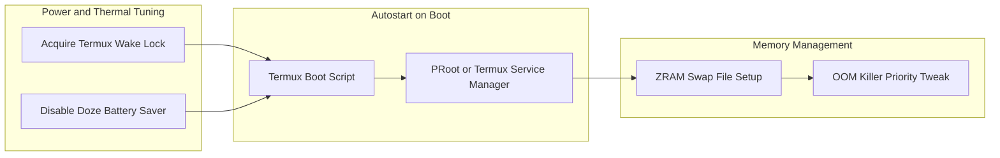

<span class="doc-pill">Termux</span> <span class="doc-pill">Optimizations</span> <span class="doc-pill">Performance</span>

# Termux Optimizations & Storage Management

Comprehensive guide for optimizing ARM64 Android Linux userlands, memory management, ZRAM swap configuration, and continuous background service retention.

---

## Performance Optimization Architecture



---

## 1. Disabling Android Phantom Process Killer (Android 12+)

Android 12 introduced a feature that kills background child processes exceeding 32 concurrent processes. Disable this via ADB:

```bash
# Execute via ADB from a connected PC
adb shell device_config put activity_manager max_phantom_processes 2147483647
adb shell settings put global settings_enable_monitor_phantom_procs false
```

---

## 2. Memory & ZRAM Swap Optimization

To prevent Out-Of-Memory (OOM) crashes when running multiple background services:

```bash
# Create a 2GB Swap file on internal storage
dd if=/dev/zero of=~/swapfile bs=1M count=2048
chmod 600 ~/swapfile

# Format and activate swap
mkswap ~/swapfile
swapon ~/swapfile

# Verify active memory and swap space
free -h
```

---

## 3. Storage I/O Optimization & RAM Disks

Mounting transient logs and temporary files in RAM (`tmpfs`) to minimize flash memory wear on eMMC/UFS storage chips:

```bash
# Add to ~/.bashrc or startup scripts
export TMPDIR=$HOME/tmp
mkdir -p $TMPDIR
```

---

## 4. Complete Autostart Script (`~/.termux/boot/01-start-homelab-services.sh`)

```bash
#!/data/data/com.termux/files/usr/bin/bash
# High-Priority Termux Initialization Script

# Acquire wake lock immediately
termux-wake-lock

# Activate Swap
swapon $HOME/swapfile 2>/dev/null

# Start SSH Daemon
sshd

# Start AdGuard Home DNS Server
if ! pgrep -x "AdGuardHome" > /dev/null; then
    $HOME/AdGuardHome/AdGuardHome --work-dir $HOME/.adguard > $HOME/adguard.log 2>&1 &
fi

# Start Tailscale Subnet Router
if ! pgrep -x "tailscaled" > /dev/null; then
    sudo tailscaled --tun=userspace-networking > $HOME/tailscale.log 2>&1 &
fi

echo "All Termux background services initialized successfully."
```
