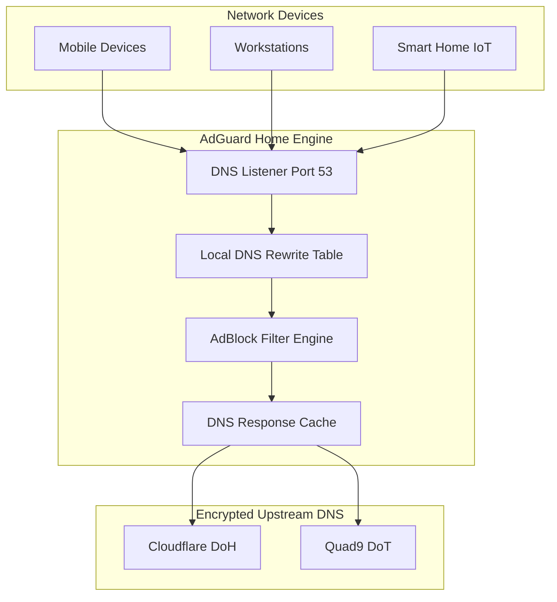

<span class="doc-pill">AdGuard Home</span> <span class="doc-pill">DNS</span> <span class="doc-pill">AdBlocking</span>

# AdGuard Home DNS & Blocklist Engine

AdGuard Home operates as a network-wide DNS resolver that blocks tracking scripts, telemetry endpoints, malware domains, and advertisements before they reach homelab devices.

---

## DNS Resolution Pipeline



---

## Upstream DNS Configuration (`AdGuardHome.yaml`)

```yaml
dns:
  bind_hosts:
    - 0.0.0.0
  port: 53
  upstream_dns:
    - https://dns.cloudflare.com/dns-query
    - tls://dns.quad9.net
    - https://dns.adguard.com/dns-query
  bootstrap_dns:
    - 1.1.1.1
    - 9.9.9.9
  cache_size: 4194304
  cache_ttl_min: 300
  cache_ttl_max: 86400
```

---

## Recommended Blocklist Subscriptions

| Filter Name | Source URL | Purpose |
| :--- | :--- | :--- |
| **AdGuard Base Filter** | Standard List | General ad blocking |
| **StevenBlack Unified** | `https://raw.githubusercontent.com/...` | Ads, malware, fake news |
| **HaGeZi Multi PRO** | `https://cdn.jsdelivr.net/...` | High-security aggressive tracker block |
| **OISD Big** | `https://big.oisd.nl` | Comprehensive telemetry blocking |

---

## Homelab Local DNS Rewrite Rules

| Pattern | IP Address | Target Service |
| :--- | :--- | :--- |
| `immich.lab` | `100.64.0.10` | Immich Photo Storage |
| `jellyfin.lab` | `100.64.0.10` | Jellyfin Media Server |
| `plex.lab` | `100.64.0.10` | Plex Media Server |
| `pve.lab` | `100.64.0.10` | Proxmox VE Admin UI |
| `grafana.lab` | `100.64.0.10` | Grafana Monitoring |
