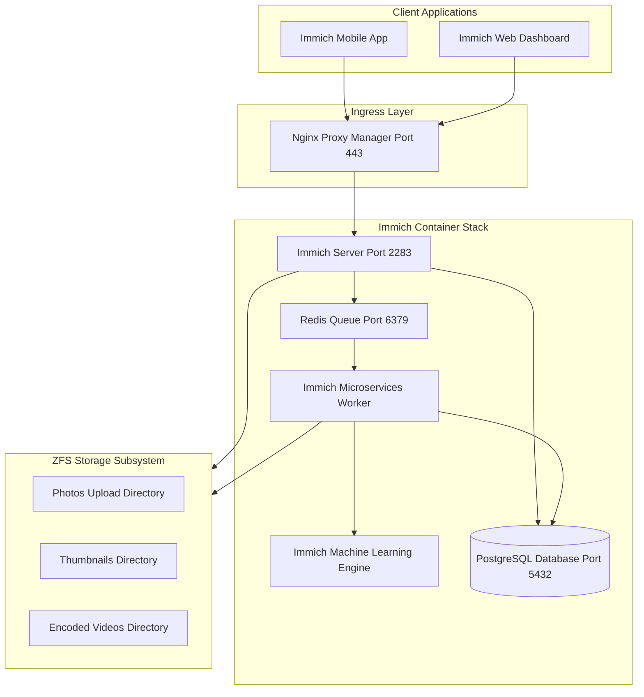

<span class="doc-pill">Immich</span> <span class="doc-pill">Media Backup</span> <span class="doc-pill">Photos</span>

# Immich Photo & Video Backup Engine

Immich is a high-performance self-hosted photo and video management solution designed as a direct open-source replacement for cloud photo backup services.

---

## Service Architecture & Microservices



---

## Production Environment Configuration (`.env`)

```ini
# Immich Core Environment Variables
UPLOAD_LOCATION=/mnt/storage/photos
IMMICH_VERSION=release

# Database Configuration
DB_HOSTNAME=immich_postgres
DB_USERNAME=postgres
DB_PASSWORD=immich_secure_db_password_9921
DB_DATABASE_NAME=immich

# Redis Configuration
REDIS_HOSTNAME=immich_redis
REDIS_PORT=6379

# Machine Learning Engine Configuration
IMMICH_MACHINE_LEARNING_URL=http://immich_machine_learning:3003
```

---

## Complete Docker Compose Stack (`docker-compose.yml`)

```yaml
version: '3.8'

services:
  immich-server:
    container_name: immich_server
    image: ghcr.io/immich-app/immich-server:${IMMICH_VERSION:-release}
    volumes:
      - ${UPLOAD_LOCATION}:/usr/src/app/upload
      - /etc/localtime:/etc/localtime:ro
    env_file:
      - .env
    ports:
      - 2283:2283
    depends_on:
      - redis
      - database
    restart: always

  immich-machine-learning:
    container_name: immich_machine_learning
    image: ghcr.io/immich-app/immich-machine-learning:${IMMICH_VERSION:-release}
    volumes:
      - model-cache:/cache
    env_file:
      - .env
    restart: always

  redis:
    container_name: immich_redis
    image: registry.hub.docker.com/library/redis:6.2-alpine
    restart: always

  database:
    container_name: immich_postgres
    image: registry.hub.docker.com/tensorchord/pgvecto-rs:pg14-v0.2.0
    environment:
      POSTGRES_PASSWORD: ${DB_PASSWORD}
      POSTGRES_USER: ${DB_USERNAME}
      POSTGRES_DB: ${DB_DATABASE_NAME}
    volumes:
      - /mnt/storage/postgres-data:/var/lib/postgresql/data
    restart: always

volumes:
  model-cache:
```

---

## Database Backup & Maintenance

Automated daily PostgreSQL database dump command:

```bash
# Dump Immich PostgreSQL database to ZFS backup dataset
docker exec -t immich_postgres pg_dumpall -c -U postgres | gzip > /mnt/storage/backups/immich_db_$(date +%Y%m%d).sql.gz
```
