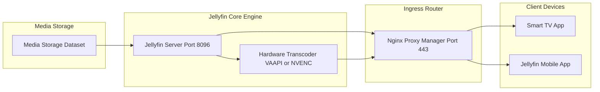

<span class="doc-pill">Jellyfin</span> <span class="doc-pill">Media</span> <span class="doc-pill">Streaming</span>

# Jellyfin Media System & Transcoding Pipeline

Jellyfin is a free software media system designed for managing, organizing, and streaming high-definition video and audio libraries across client devices.

---

## Streaming & Hardware Acceleration Pipeline



---

## Hardware Transcoding (Intel QuickSync / AMD VAAPI)

To enable hardware-accelerated video transcoding (reducing CPU load from 100% to under 5%), pass the DRI device graphics node into the Docker container:

```bash
# Verify graphics render node permissions on host
ls -la /dev/dri/renderD128
# crw-rw---- 1 root render 226, 128 Jan 20 10:00 /dev/dri/renderD128

# Add user to render group
sudo usermod -aG render terrich
```

---

## Production Docker Compose Setup

```yaml
version: '3.8'

services:
  jellyfin:
    image: jellyfin/jellyfin:latest
    container_name: jellyfin
    user: 1000:1000
    network_mode: 'host'
    environment:
      - JELLYFIN_PublishedServerUrl=https://jellyfin.lab
    volumes:
      - ./config:/config
      - ./cache:/cache
      - /mnt/storage/media:/media
      - /tmp/transcode:/transcode
    devices:
      - /dev/dri/renderD128:/dev/dri/renderD128
    restart: 'unless-stopped'
```

---

## Performance Tuning Checklist

- **RAM Disk Transcoding**: Set transcode directory to `/tmp/transcode` (`tmpfs`) to prevent SSD write wear.
- **Throttle Transcoding**: Enable "Throttle Transcodes" in Jellyfin Admin settings so the GPU pauses encoding when the client buffer is full.
- **Enable Tone Mapping**: Enable Hable / Reinhard HDR-to-SDR tone mapping for 4K HDR playback on SDR displays.
