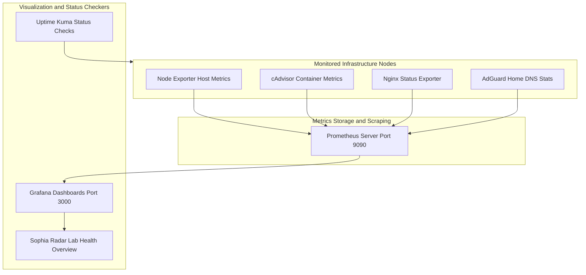

<span class="doc-pill">Monitoring</span> <span class="doc-pill">Prometheus</span> <span class="doc-pill">Grafana</span>

# Monitoring & Telemetry Stack

Comprehensive, lightweight monitoring stack for tracking host system health, container resource utilization, network uptime, and service latency.

---

## Telemetry Flowchart & Metrics Pipeline



---

## Prometheus Configuration (`prometheus.yml`)

```yaml
global:
  scrape_interval: 15s
  evaluation_interval: 15s

scrape_configs:
  - job_name: 'prometheus'
    static_configs:
      - targets: ['localhost:9090']

  - job_name: 'node_exporter'
    static_configs:
      - targets: ['100.64.0.10:9100', '100.64.0.11:9100']

  - job_name: 'cadvisor'
    static_configs:
      - targets: ['100.64.0.10:8080']

  - job_name: 'nginx_proxy_manager'
    static_configs:
      - targets: ['100.64.0.10:9113']
```

---

## Full Docker Compose Telemetry Stack

```yaml
version: '3.8'

services:
  prometheus:
    image: prom/prometheus:v2.45.0
    container_name: prometheus
    restart: unless-stopped
    volumes:
      - ./prometheus.yml:/etc/prometheus/prometheus.yml
      - prometheus_data:/prometheus
    ports:
      - '9090:9090'

  grafana:
    image: grafana/grafana:10.0.0
    container_name: grafana
    restart: unless-stopped
    ports:
      - '3000:3000'
    environment:
      - GF_SECURITY_ADMIN_PASSWORD=grafana_secure_admin_password
    volumes:
      - grafana_data:/var/lib/grafana

  node-exporter:
    image: prom/node-exporter:v1.6.0
    container_name: node-exporter
    restart: unless-stopped
    ports:
      - '9100:9100'

  cadvisor:
    image: gcr.io/cadvisor/cadvisor:v0.47.0
    container_name: cadvisor
    restart: unless-stopped
    ports:
      - '8080:8080'
    volumes:
      - /:/rootfs:ro
      - /var/run:/var/run:ro
      - /sys:/sys:ro
      - /var/lib/docker/:/var/lib/docker:ro

  uptime-kuma:
    image: louislam/uptime-kuma:1.22.1
    container_name: uptime-kuma
    restart: unless-stopped
    ports:
      - '3001:3001'
    volumes:
      - uptime_kuma_data:/app/data

volumes:
  prometheus_data:
  grafana_data:
  uptime_kuma_data:
```
