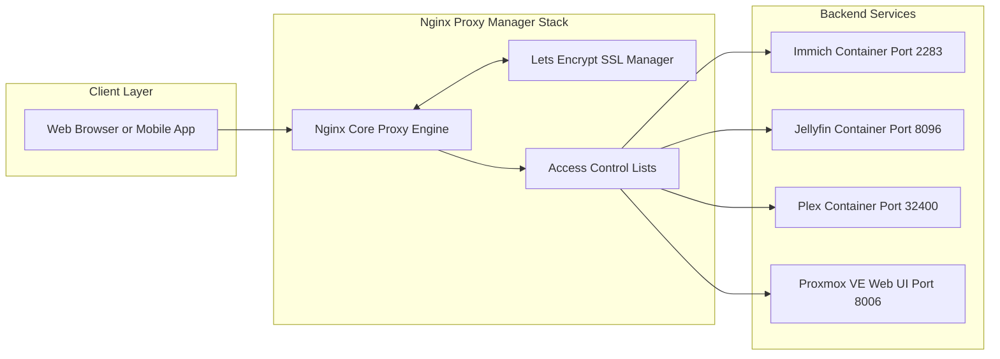

<span class="doc-pill">Nginx</span> <span class="doc-pill">Proxy Manager</span> <span class="doc-pill">Reverse Proxy</span>

# Nginx Proxy Manager & Reverse Proxy Configuration

Nginx Proxy Manager (NPM) serves as the central reverse proxy, SSL termination engine, and traffic router for all self-hosted homelab services.

---

## Overview & Architecture

Nginx Proxy Manager translates incoming web requests (`https://immich.homelab.net`) into internal container ports (`http://100.100.1.10:2283`) while managing SSL/TLS certificates automatically via Let's Encrypt and Cloudflare DNS challenge.



---

## Docker Compose Setup

Run Nginx Proxy Manager using Docker Compose with MariaDB as the backend database:

```yaml
version: '3.8'
services:
  app:
    image: 'jc21/nginx-proxy-manager:latest'
    container_name: nginx-proxy-manager
    restart: unless-stopped
    ports:
      - '80:80'      # HTTP traffic
      - '81:81'      # NPM Web Management Admin UI
      - '443:443'    # HTTPS traffic
    volumes:
      - ./data:/data
      - ./letsencrypt:/etc/letsencrypt
    environment:
      DB_MYSQL_HOST: "db"
      DB_MYSQL_PORT: 3306
      DB_MYSQL_USER: "npm"
      DB_MYSQL_PASSWORD: "npm_password_secret"
      DB_MYSQL_NAME: "npm"

  db:
    image: 'jc21/mariadb-aria:latest'
    container_name: npm-db
    restart: unless-stopped
    environment:
      MYSQL_ROOT_PASSWORD: "npm_root_password_secret"
      MYSQL_DATABASE: "npm"
      MYSQL_USER: "npm"
      MYSQL_PASSWORD: "npm_password_secret"
      MYSQL_AUTH_PLUGIN: "mysql_native_password"
    volumes:
      - ./mysql:/var/lib/mysql
```

---

## Nginx Custom Location & Security Headers

### 1. WebSocket Proxy Configuration

For real-time web socket services (e.g., Immich live uploads, Jellyfin playback sync):

```nginx
# Custom Nginx Advanced Configuration
proxy_set_header Upgrade $http_upgrade;
proxy_set_header Connection "upgrade";
proxy_set_header Host $host;
proxy_set_header X-Real-IP $remote_addr;
proxy_set_header X-Forwarded-For $proxy_add_x_forwarded_for;
proxy_set_header X-Forwarded-Proto $scheme;
proxy_http_version 1.1;
```

### 2. Security Hardening Headers

Included in Nginx Proxy Manager custom header configuration:

```nginx
# Security Headers
add_header Strict-Transport-Security "max-age=31536000; includeSubDomains; preload" always;
add_header X-Frame-Options "SAMEORIGIN" always;
add_header X-Content-Type-Options "nosniff" always;
add_header X-XSS-Protection "1; mode=block" always;
add_header Referrer-Policy "strict-origin-when-cross-origin" always;
```

### 3. File Upload Limit Adjustment

To enable large file uploads (e.g. 10GB video files in Immich / Nextcloud):

```nginx
client_max_body_size 10G00M;
proxy_read_timeout 600s;
proxy_send_timeout 600s;
```

---

## Host Mapping Table

| Subdomain | Forward Host IP | Forward Port | WebSockets | SSL Certificate |
| :--- | :--- | :--- | :--- | :--- |
| `immich.lab` | `100.64.0.10` | `2283` | Enabled | Let's Encrypt |
| `jellyfin.lab` | `100.64.0.10` | `8096` | Enabled | Let's Encrypt |
| `plex.lab` | `100.64.0.10` | `32400` | Disabled | Let's Encrypt |
| `pve.lab` | `100.64.0.10` | `8006` (HTTPS) | Enabled | Let's Encrypt |
| `dns.lab` | `100.64.0.11` | `3000` | Disabled | Let's Encrypt |
| `grafana.lab` | `100.64.0.10` | `3000` | Enabled | Let's Encrypt |
