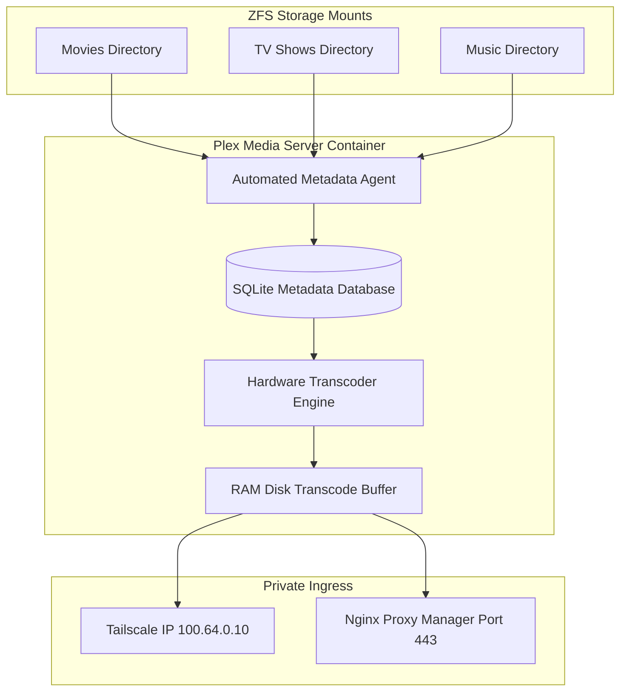

<span class="doc-pill">Plex</span> <span class="doc-pill">Media</span> <span class="doc-pill">Streaming</span>

# Plex Media Server Architecture

Plex organizes personal media collections and streams video, audio, and photos seamlessly across home network clients and remote devices.

---

## Library Architecture



---

## Docker Compose Configuration

```yaml
version: '3.8'

services:
  plex:
    image: lscr.io/linuxserver/plex:latest
    container_name: plex
    network_mode: host
    environment:
      - PUID=1000
      - PGID=1000
      - VERSION=docker
      - PLEX_CLAIM=claim-xxxxxxxxx
    volumes:
      - ./config:/config
      - /mnt/storage/media/movies:/data/movies
      - /mnt/storage/media/tv:/data/tv
      - /tmp/transcode:/transcode
    devices:
      - /dev/dri:/dev/dri
    restart: unless-stopped
```

---

## Custom Network Settings

To allow Plex clients to connect directly over Tailscale without relaying through Plex cloud proxy servers:

1. Open Plex Web -> **Settings** -> **Network**.
2. Set **Custom server access URLs** to `https://plex.lab:443, http://100.64.0.10:32400`.
3. Set **LAN Networks** to `100.64.0.0/255.192.0.0, 172.18.0.0/255.255.0.0`.
